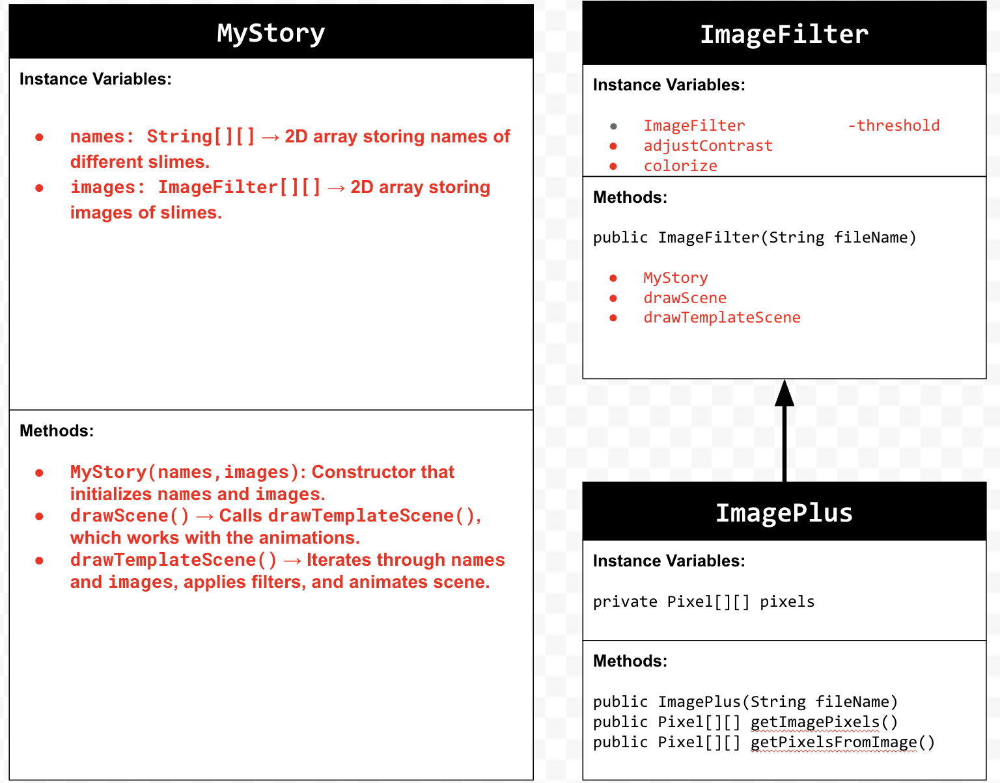
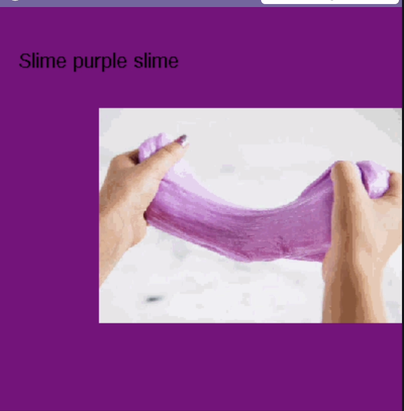
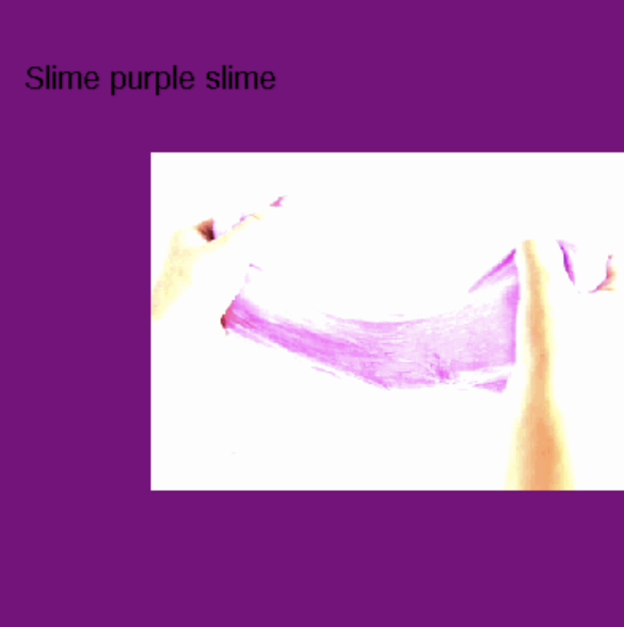
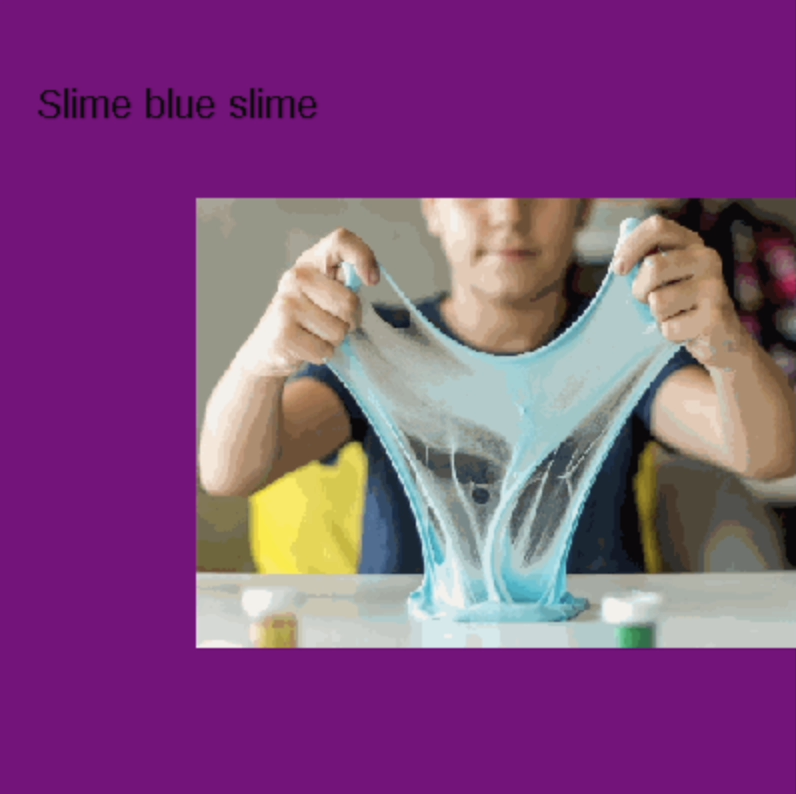
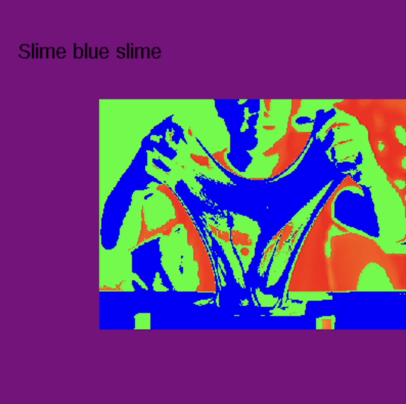
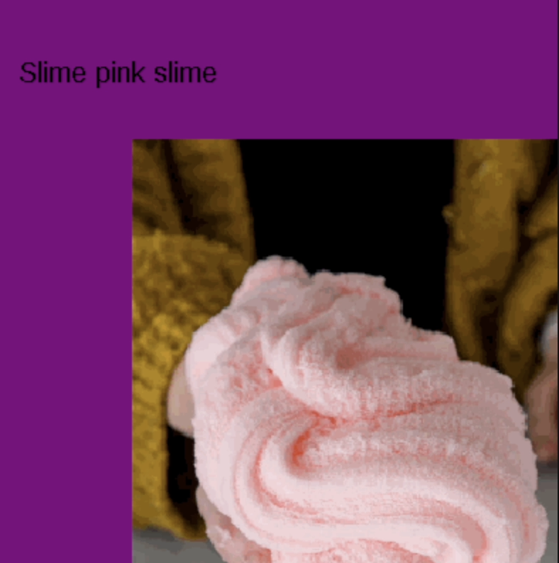
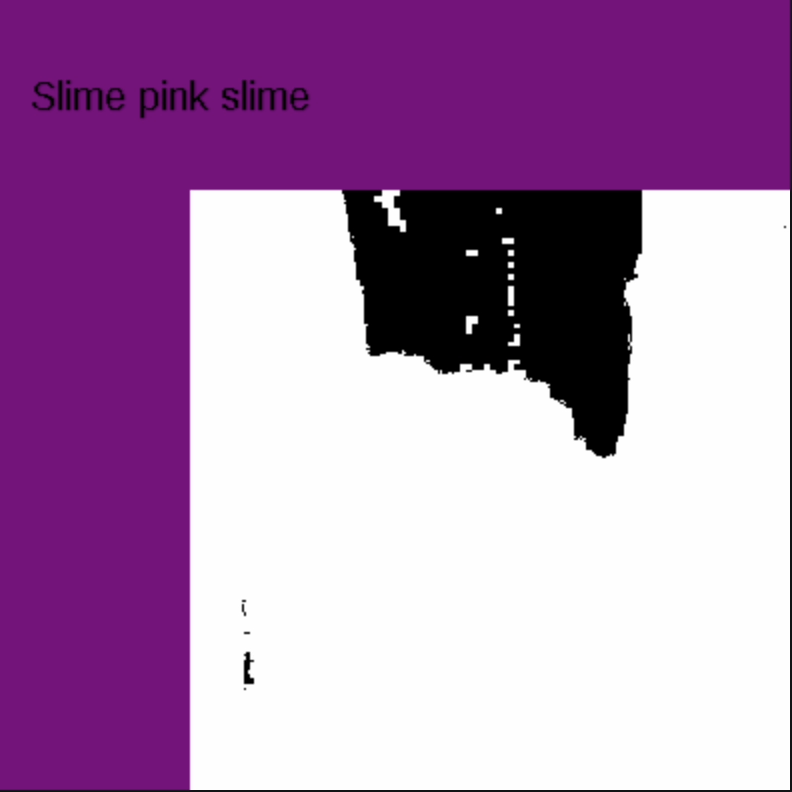
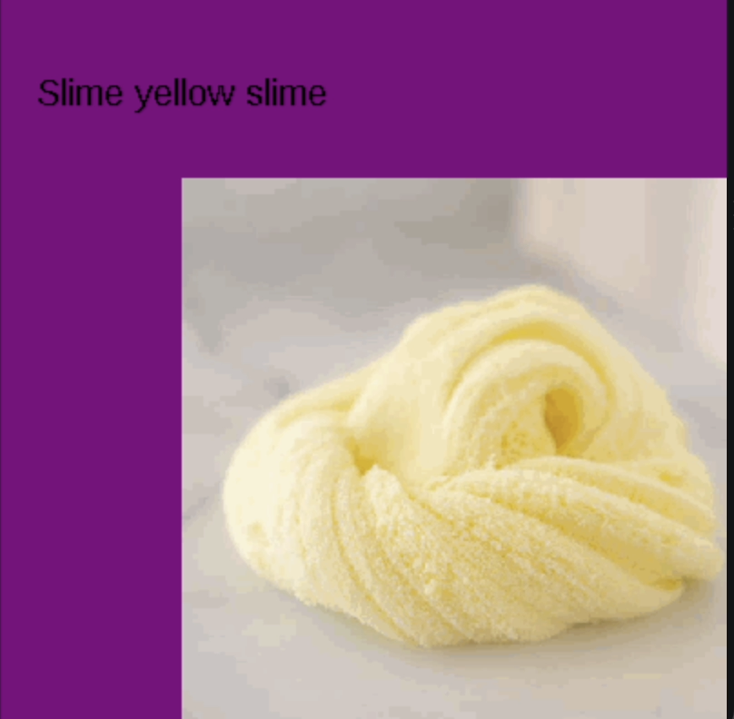
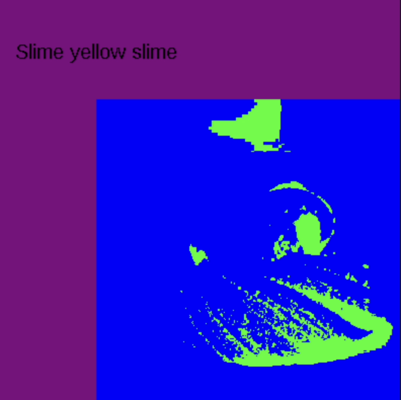

# Unit 4 - Personal Narrative

## Introduction

Images are often used to portray our personal experiences and interests. We also use image filters and effects to change or enhance the mood of an image. When combined into collages and presentations, these images tell a story about who we are and what is important to us. Your goal is to create a personal narrative using The Theater that consists of images of your personal experiences and/or interests, incorporates data related to these experiences and/or interests that can be organized in a 2D array, and uses image filters and effects to change or enhance the mood of your images.

## Requirements

Use your knowledge of object-oriented programming, two-dimensional (2D) arrays, and algorithms to create your personal narrative collage or animation:

- **Create at least two 2D arrays** – Create at least two 2D arrays to store the data that will make up your visualization.
- **Implement one or more algorithms** – Implement one or more algorithms that use loops and two-way or multi-selection statements with compound Boolean expressions to analyze the data.
- **Use Image Filters** - Include multiple image filters learned from this unit, and additionally create new ones of your own.
- **Use methods in the String class** – Use one or more methods in the String class in your program, such as to determine whether the name of an image file contains specific characters.
- **Create a visualization** – Create an image or animation that conveys the story of the data by illustrating the patterns or relationships in the data.
- **Document your code** – Use comments to explain the purpose of the methods and code segments and note any preconditions and postconditions.

## UML Diagram

## Video

## Story Description

For my story that I animated in my showcases, I chose to do different colors of slime. I used to love to play with slime and even had an entire business for it so I thought this would be perfect to implement this into my coding project. The data in my project that is represented in 2D arrays were the filters. These directly relate to my story my animation showcases by chagning the RBGS which are basically as mix of colors, and making it appear differently.

## Image Filter Analysis

The two filters that I chose to use in my animation were the contrast and the colorize. The way contrast worked was it multiplied the red, green, and blue by 255, if it equaled 255, and contrasted those colors. The colorize would work by if it equaled to 85, it would add 55 to each gray color, and it would change red's current pixel to 255, and blue's to 0. If the gray value was equal to 170, then both blue and red would be set to 0, but green would be at 255. Else, the program would set red and green to 0, while blue would be at 255. 

